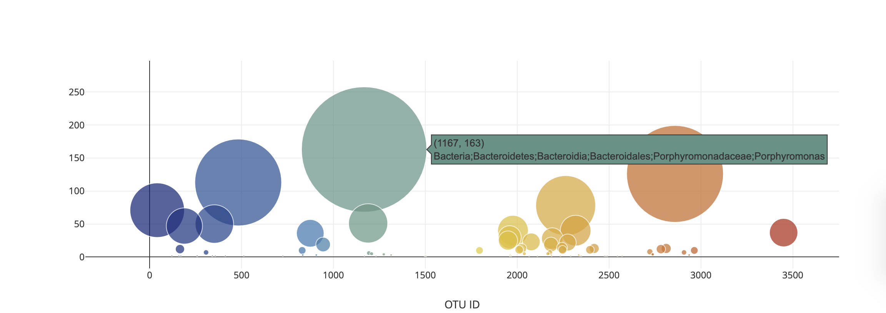

# belly-button-challenge

##Project Objective
In this project, an interactive dashboard was built to explore the Belly Button Biodiversity dataset, which catalogs the microbes that colonize human navels in JSON format.

The dataset reveals that a small handful of microbial species (also called operational taxonomic units, or OTUs, in the study) were present in more than 70% of people, while the rest were relatively rare.

Demographics information is dynamically populated based upon a user-selected test subject ID. A bar chart and a bubble chart also update once the ID is changed. Code has been written using Plotly, JavaScript, HTML, CSS, and D3.js.

GitHub Pages link: https://joshuasamuel4825.github.io/belly-button-challenge/

##Technologies
* Javascript
* Plotly
* HTML, CSS
##Methodology
To complete the data exploration, the Plotly D3 Javascript library was used to create three visualizations for each subject in the trial. These visualizations are accessed via dropdown menu.

Additionally, each dropdown option includes the subject metadata persisting of ID, Ethnicity, Gender, Age, Location, Body Type, and Frequency of Washes.

For each subject, two visualizations are available: a horizontal bar chart of the top ten most prevalent OTUs in the sample and a bubble chart of all OTUs in the sample. The bar chart and the bubble chart are further interactive in that hovering over the specific bar or bubble will give the scientific name of the OTU represented.

##References
Hulcr, J. et al. (2012) A Jungle in There: Bacteria in Belly Buttons are Highly Diverse, but Predictable. Retrieved from: http://robdunnlab.com/projects/belly-button-biodiversity/results-and-data/
